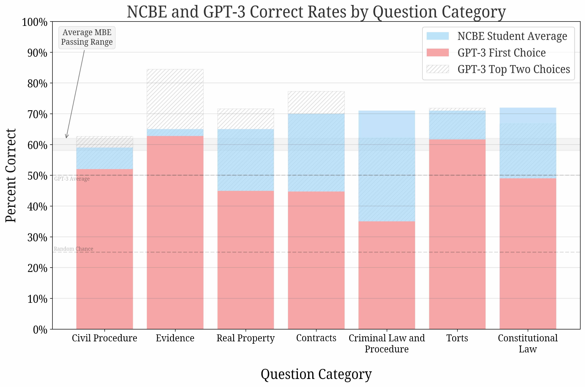

GPT Takes the Bar - Supplementary Information
==================
  * __N.B.__: This is a preprint. 
  *  __Title__: GPT Takes the Bar
  *  __Authors__: [Michael Bommarito](https://www.linkedin.com/in/bommarito/), [Daniel Martin Katz](https://www.linkedin.com/in/daniel-katz-3b001539/)
  * __Publication URL__: [arXiv:2212.14402](https://arxiv.org/abs/2212.14402), [SSRN](https://papers.ssrn.com/sol3/papers.cfm?abstract_id=4314839)
  * __Publication Date__: 2022-12-29

## Abstract
Nearly all jurisdictions in the United States require a professional license exam, commonly referred to as “the Bar Exam,” as a precondition for law practice. To even sit for the exam, most jurisdictions require that an applicant completes at least seven years of post-secondary education, including three years at an accredited law school. In addition, most test-takers also undergo weeks to months of further, exam-specific preparation. Despite this significant investment of time and capital, approximately one in five test-takers still score under the rate required to pass the exam on their first try. In the face of a complex task that requires such depth of knowledge, what, then, should we expect of the state of the art in “AI?” In this research, we document our experimental evaluation of the performance of OpenAI’s text-davinci-003 model, often-referred to as GPT-3.5, on the multistate multiple choice (MBE) section of the exam. While we find no benefit in fine-tuning over GPT-3.5’s zero-shot performance at the scale of our training data, we do find that hyperparameter optimization and prompt engineering positively impacted GPT-3.5’s zero-shot performance. For best prompt and parameters, GPT-3.5 achieves a headline correct rate of 50.3% on a complete NCBE MBE  practice exam, significantly in excess of the 25% baseline guessing rate, and performs at a passing rate for both Evidence and Torts. GPT-3.5’s ranking of responses is also highly correlated with correctness; its top two and top three choices are correct 71% and 88% of the time, respectively, indicating very strong non-entailment performance. While our ability to interpret these results is limited by nascent scientific understanding of LLMs and the proprietary nature of GPT, we believe that these results strongly suggest that an LLM will pass the MBE component of the Bar Exam in the near future.

### Table of Contents

* [Jupyter Notebook with Tables and Figures](publication_tables.ipynb)
* [Prompt Examples](PROMPTS.md)
* [Example Session Log](sample_session_log.html)

## Progression of Models over Time

 
 
## `text-davinci-003` Performance by Question Category

 
 
 
